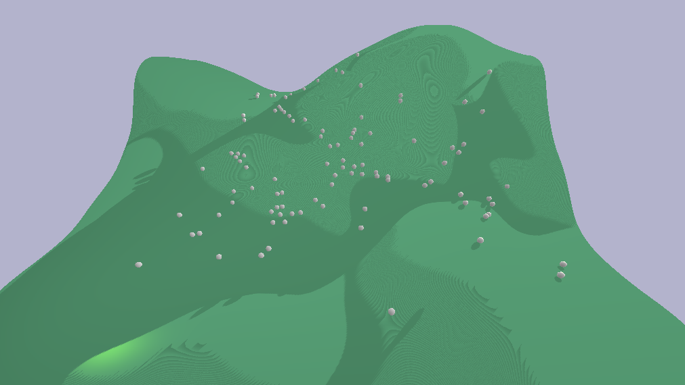
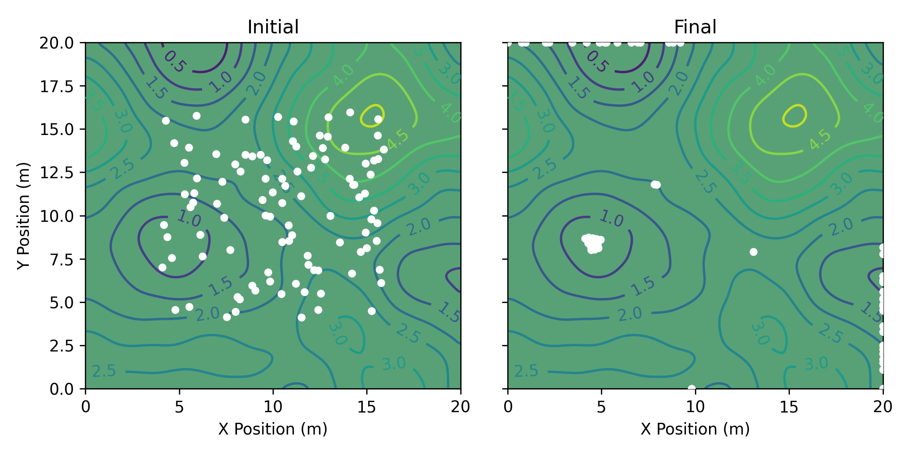
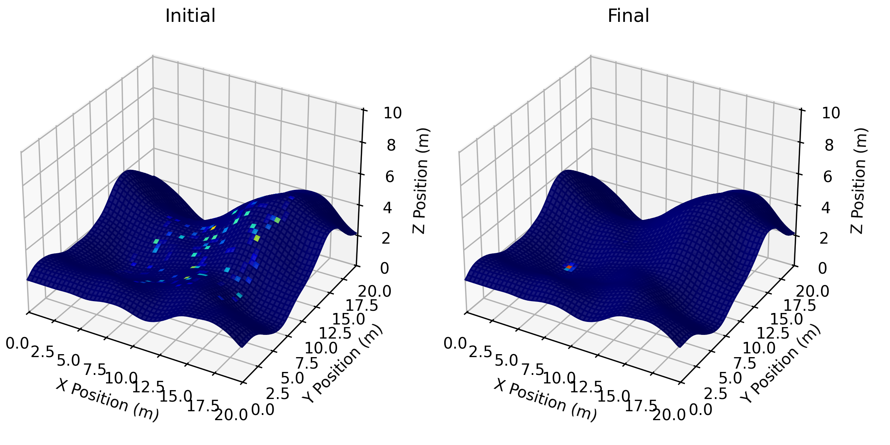

# Globus Compute Golf Simulation Demo

This demo showcases executing simulations at scale using [Globus Compute](https://www.globus.org/compute).

As a proxy for a *real scientific simulation*, this demo simulates dropping golf balls on a green.
A golf green is randomly generated using [Perlin noise](https://en.wikipedia.org/wiki/Perlin_noise), and the simulation is performed using [PyBullet](https://github.com/bulletphysics/bullet3).

* [Installation](#installation)
* [Visualize a Simulation](#visualize-a-simulation)
* [Simulate at Scale](#simulate-at-scale)
* [Contributing](#contributing)

## Installation

1. **Clone the repository and navigate to the project directory:**
   ```bash
   git clone https://github.com/globus-labs/globus-compute-golf-demo
   cd globus-compute-golf-demo
   ```
2. **Create a virtual environment:**
   This demo requires Python 3.9 or later.
   ```bash
   python -m venv venv
   . venv/bin/activate
   ```
   You may use alternate environment managers, such as Conda, provided you have `pip` installed.
   We **do not** recommend installing the packages into your system Python.
3. **Install the package and dependencies:**
    ```bash
    pip install .
    ```
4. **Configure a Globus Compute Endpoint:**
   This step can be performed on your local machine or on a remote machine.
   You will need to authenticate with Globus Auth if you have not used Globus Compute on your local device before.
   A UUID for your endpoint will be returned; save this for later (you can find it later with `globus-compute-endpoint list`).
   ```bash
   globus-compute-endpoint configure golf-demo
   globus-compute-endpoint start golf-demo
   ```
   For more information on configuring Endpoints, check out the [docs](https://globus-compute.readthedocs.io/en/latest/endpoints/index.html).

## Visualize a Simulation

We will start with running a single simulation locally to visualize what the simulation looks like.
This will generate a random terrain and drop a ball at a random position.

```bash
python run_single.py --num-balls 100
```

You should see a pop up window that looks like the following.


The parameters of the simulation are fully configurable.
Use `python run_single.py --help` to see all of the options.

## Simulate at Scale

Next, we can run the same simulation at scale by generating `n` random initial ball positions and submitting one simulation per ball to Globus Compute.
Globus Compute will manage the parallel execution of tasks on the Endpoint you configured.
Replace `<UUID>` with the UUID of your Endpoint.

```bash
python run_globus_compute.py --num-balls 1000 --endpoint <UUID>
```

> [!TIP]
> Passing `--process-pool 8` instead of `--endpoint <UUID>` will run the simulations across a pool of 8 local processes rather than via Globus Compute.

Because the simulations are executed in parallel on remote processes, the simulations are performed in a "headless" mode (i.e., the simulation is not rendered to the screen).
The script visualizes the results of the simulations via plots that are saved to `images/`.

**2D Contour Plot** (`images/contour.png`)


**3D Terrain Heatmap** (`images/terrain.png`)


## Contributing

To contributed to this repository:

1. Fork and/or create a branch for your features/changes.
   The `main` branch of this repository has branch protection enabled so all changes must be made via a pull request.
2. Install the package with development dependencies.
   ```bash
   pip install -e .[dev]
   ```
3. Make your changes.
4. Run the pre-commit checks and fix any issues.
   ```bash
   pre-commit run --all-files
   ```
5. Commit your changes and open a pull request.
